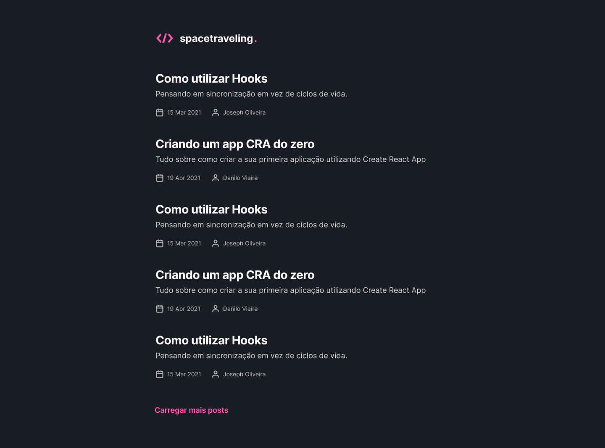

<h1 align="center">
    
    <br>
    Ignite - React - Spacetravelling
</h1>

<h4 align="center">
  A Next.js + Prismic CMS blog
</h4>



## :rocket: Technologies

- [React.js](https://reactjs.org/)
- [Next.js](https://nextjs.org)
- [Prismic](https://prismic.io)

## :information_source: How To Use

```bash
git clone https://github.com/felipe-jm/ignite-react-spacetravelling.git

cd ignite-react-spacetravelling

# Create your .env.local file in the root and populate it with the necessary prismic enviromental variables

yarn

yarn dev
```

## :memo: License

This project is under the MIT license. See the [LICENSE](https://github.com/felipe-jm/ignite-react-spacetravelling/blob/master/LICENSE) for more information.

---

Made with much :heart: and :muscle: by Felipe Jung :blush: <a href="https://www.linkedin.com/in/felipe-jung/">Talk to me!</a>
